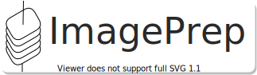

---

[](https://github.com/adbeda/imageprep)

[](https://codecov.io/gh/adbeda/imageprep)

ImagePrep is a tool for preparing image labels in different formats, primarily for object detection tasks.

Deep Learning frameworks expect datasets to be prepared in a structure, style or format that 
fits into their workflow. With ImagePrep, you can easily organize labels according to these 
requirements. Currently, the tool simplifies the process of preparing labels using COCO, 
Pascal VOC and YOLO style format. Conversion to one from another is also supported.


##### Installation
    
  stable version
    
    pip install imageprep
  
  latest version:
  
    # clone repo
    git clone https://github.com/adbeda/imageprep    
    
    # install
    cd imageprep && pip install -e .
    
    # or simply with:
    python -m pip install 'git+https://github.com/adbeda/imageprep.git' 
    
        


##### Usage

      
Example 1: Organize images and labels in COCO style 
 
   ```python
from imageprep import coco

"""
Folder Structure of a moc dataset

data
├── images
│   ├── 145_28.jpg
│   ├── 79_38.jpg
│   ├── 79_45.jpg
│   └── 80_7.jpg
└── labels
    ├── 145_28.txt
    ├── 79_38.txt
    ├── 79_45.txt
    └── 80_7.txt
"""

# folder containing images
image_path = "data/images/"
label_path = "data/labels/"

# run task
coco_dict = coco.coco_format_folder(image_path, label_path)

print(coco_dict)
``` 
Output:
     
   ```json
[ {
      "image":[{
            "file_name":"data/images/145_28.jpg",
            "height":416,
            "width":416
         }],
      "annotations":[{
            "bbox":[336, 398, 416, 416],
            "id":1,
            "segmentation":[],
            "area":1440,
            "category_id":0
         },
         {
            "bbox":[3, 91, 105, 163],
            "id":2,
            "segmentation":[],
            "area":7344,
            "category_id":0
         },
         {
            "bbox":[134, 31, 196, 95],
            "id":3,
            "segmentation":[],
            "area":3968,
            "category_id":0
         }
      ],
      "image_id":0
   },
   {
      "image":[{
            "file_name":"data/images/79_38.jpg",
            "height":416,
            "width":416
         }],
      "annotations":[{
            "bbox":[257, 306, 325, 370],
            "id":1,
            "segmentation":[],
            "area":4352,
            "category_id":0
         }],
      "image_id":1}
   
   ]
```

Example 2: Convert absolute bounding box values to YOLO style formats
 
   <b>X<sub>min</sub>Y<sub>min</sub>X<sub>max</sub>Y<sub>max</sub></b>  ----->   <b>X<sub>center</sub>Y<sub>center</sub> Width Height</i></b>  


   ```python
from imageprep import yolo

"""
# Input BBOX in absolute format (Xmin, Ymin, Xmax, Ymax)

├── labels
    ├── 145_28.txt
    │   ├── 336 398 416 416
    │   ├──   3  91 105 163
    │   ├── 134  31 196  95
    ├── 79_38.txt
    │   ├── 257 306 325 370   
    ├── 79_45.txt
    │   ├──   0 399 133 416
    │   ├── 161 255 239 343
    │   ├── 336  32 416 108      
    └── 80_7.txt
        ├── 267 223 391 319

"""

# folder containing images
image_path = "data/images/"
label_path = "data/labels/" 
output_path = "data/yolo_labels/"

# run task and save text 
yolo.convert_to_yolo(image_path, label_path, output_path)


```
Output:

```python

# Output BBOX in relative format (Xcenter, Ycenter, Width, Height)

├── yolo_labels
    ├── 145_28.txt
    │   ├── 0.9038461538461539 0.9783653846153847 0.19230769230769232 0.04326923076923077
    │   ├── 0.12980769230769232 0.30528846153846156 0.2451923076923077 0.17307692307692307
    │   ├── 0.3966346153846154 0.1514423076923077 0.14903846153846154 0.15384615384615385
    ├── 79_38.txt
    │   ├── 0.6995192307692308 0.8125 0.16346153846153846 0.15384615384615385   
    ├── 79_45.txt
    │   ├── 0.15985576923076925 0.9795673076923077 0.3197115384615385 0.040865384615384616
    │   ├── 0.4807692307692308 0.71875 0.1875 0.21153846153846156
    │   ├── 0.9038461538461539 0.16826923076923078 0.19230769230769232 0.1826923076923077
    └── 80_7.txt
        ├── 0.7908653846153847 0.6514423076923077 0.2980769230769231 0.23076923076923078
        
```   
 
#### Command Line

```commandline
Usage: imageprep [OPTIONS] COMMAND [ARGS]...

  Dataset Preparation Helper

Options:
  -h, --help  Show this message and exit.

Commands:
  convert-to-yolo   Converts absolute bbox values to relative ones
  create-path-file  Writes out the path to images in a folder as a list
  get-image-name    Prints out the names of images in a folder
  resize-images     Resizes Image dimension to a size provided by user
  

```

#### 

The CLI is still in early stage of development.

##### Use case:

The above output can easily be integrated with data registration steps 
requried to train a Mask-RCNN model using [Detectron2](https://github.com/facebookresearch/detectron2). 
Check out the example [here](./examples/Imprep_and_Detectron2.ipynb). 

##### Other functionalities included in the library:
- Create a  list of all bounding boxes
- Stack and save images as numpy array
- Dump labels as JSON objects to a file
- Resize images within a single or multiple folders 
- Convert relative (YOLO style) values to absolute ones
- Customize a python dictionary of labels to a Detectron2 format
 and more ...
 

##### TODO: current and future work
 - Improve the CLI
 - Add workflow for VOC style
 - Test against RCNN families
 - Create a documentation
 - Improve integration for Detectron2 and YOLO
  

